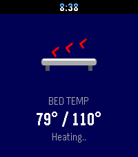
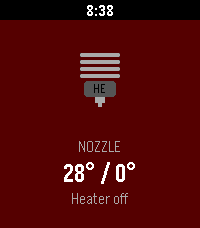
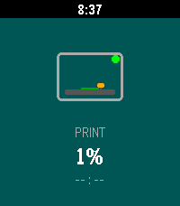

# Klipper Monitor

A Pebble watchapp for keeping an eye on your Klipper 3D printer, via
[Moonraker](https://moonraker.readthedocs.io/).

<p>
  
  
  
</p>

## Features

- Bed and nozzle temperatures with targets and heating status
- Print progress with estimated time remaining
- Animated cards — flip between them with the up/down buttons
- A progress bar along the top counts down to the next refresh

## Setup

1. Build and install:

   ```sh
   pebble build
   pebble install --emulator emery   # or --cloudpebble
   ```

2. Open the app's settings in the Pebble phone app and enter the printer Moonraker
   URL, e.g. `http://192.168.1.100` or `http://printer.local`. Your phone
   needs to be able to reach the printer on the network.

## How it works

The phone-side JS polls Moonraker's `/printer/objects/query` endpoint every
10 seconds and forwards temperatures, print state, and progress to the watch
over AppMessage.

Targets the Pebble Time 2 (emery). Built with the
[Pebble SDK](https://developer.repebble.com).
